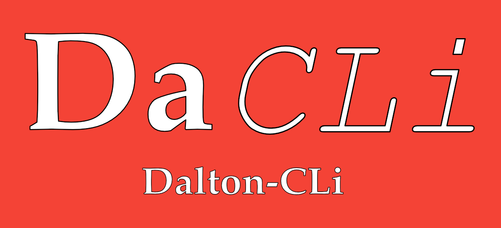

**Dalton-CLi** is a command line utility to make doing stoichiometry a little less tedious.

## About

Chemistry is so amazingly fascinating, but the sheer amount repetitive, tedious calculation can kill interest and bog
down anyone's workflow. The worst offender of this is stoichiometry: calculating molecular weights, mole ratios, and
so forth.

**Dalton-CLi** exists to ameliorate this. It is a simple but useful command line utility that does much of the math for
for. You don't even need to look at a periodic table, just type in the molecular formula of the compound you're working
with and in less than a second you have its molecular weight, no matter how complicated or obscure it may be.

So what makes **Dalton-CLi** better than a simple Google search? Well for starters, **Dalton-CLi** doesn't require an
Internet connection. Once installed, it's completely local to your machine. You only need Wi-Fi to get updates. But
beyond that, **Dalton-CLi** is highly personalizable. You can define custom chemical symbols for groups you find
yourself using a lot, save chemical formulas on disk for easy access and quick reference (perfect for when you have to
look up the same compound over and over again), and generate theoretical mass spectra for any compound you can imagine.
And as an ongoing open-source project, **Dalton-CLi** is just going to make your chemistry studies easier and easier.

## Installation
**Dalton-CLi** is a work in progress and there is not (yet) an easy way to install it other than to clone the
repo and install it with pip.

```bash
$ git clone https://github.com/periodicaidan/dalton-cli
$ cd dalton-cli
$ pip install .
```

If you do not have pip, you can read how to download it [here](https://pip.pypa.io/en/stable/installing/).

If you wish to edit and play with **Dalton-CLi**'s source code, you can do so by performing those three commands above,
but setting the `--editable` flag on pip:

```bash
$ pip install --editable .
```

Please note that currently, **Dalton-CLi** only works with Python 3.x

**Dalton-CLi** requires a Python interpreter run. For Macintosh users, you've no need to install anything as
**Dalton-CLi** will run just fine on the interpreter shipped with every Apple computer.
For everyone else, you can install the latest version of Python [here](https://www.python.org/downloads/).

## Using Dalton-CLi
When you install **Dalton-CLi**, you can view the home page simply by running

```bash
$ dalton
```

This will show you a "splash page" of sorts, and give you a rundown of everything **Dalton-CLi** can do.

### `calc` — Get the Molar Mass of a Compound

The core command of **Dalton-CLi** is the `calc` command.

```bash
$ dalton calc H2O
18.015 g/mol
```
You give `calc` a molecular formula and **Dalton-CLi** will instantly give you the molecular weight of the compound you 
entered.

In the current version of **Dalton-CLi**, `calc` can handle *one level of parentheses*. Additionally, formulas
containing parentheses must be placed between quotation marks or the parentheses must be escaped with backslashes.

```bash
$ dalton calc 'O(C2H5)2'  # Correct
74.123 g/mol  # The correct molar weight of diethyl ether

$ dalton calc O\(C2H5\)2  # Using escape sequences
74.123 g/mol

$ dalton calc "O((CH2)2H)2"  # Nesting unsupported
45.061 g/mol  # Incorrect molar weight

$ dalton calc O(C2H5)2  # Parentheses seen as bash tokens
-bash: syntax error near unexpected token `('  # An error
```

`calc` has several options for analyzing chemical formulas. Modifying it with the `-M` or `--mass-spec` flag will print
a theoretical mass spectrum for the compound.

```bash
$ dalton calc C2H5OH --mass-spec
   C : 52.1%
   H : 13.1%
   O : 34.7%

$ dalton calc -Mi NaHSO4  # using -M with the -i or --histogram flag will display a bar graph
  Na : ███████████ 19.1%
   H :  0.8%
   S : ████████████████ 26.7%
   O : ███████████████████████████████ 53.3%

```

### `moiety` — Custom Chemical Symbols

Chemical formulas often become long and confusing, so chemists often come up with abbreviations for common *moieties*, 
or groups of atoms in a molecule that are considered as a unit. One of **Dalton-CLi**'s key features is to allow users
to define their own moieties with the `moiety` command.

To define a new moiety, you use the `add` command, followed by the symbol for your moiety and then the group that
the symbol represents. To demonstrate, one often sees the group C<sub>2</sub>H<sub>5</sub> (ethyl) in chemistry, so we 
often abbreviate it "Et". If we would like to calculate the molecular weight of ethanol by simply issuing `dalton calc 
EtOH`, we would do it as follows:

```bash
$ dalton moiety add Et C2H5  # Define an ethyl moiety
Et added to moiety profile (mass: 29.062 g/mol)

$ dalton calc EtOH
46.069 g/mol  # Correct molar mass of ethanol
```

And the great thing about **Dalton-CLi** is that it will treat these custom moieties, more or less, as their own
entities. So if we would like to get the molecular weight of diethyl ether (which earlier was long and required
specific formatting because of the parentheses), we can now simply say:

```bash
$ dalton calc Et2O
74.123 g/mol
```

Note that the way **Dalton-CLi** parses chemical formulas requires you to begin your moieties with a capital letter. If
you would like to use all lowercase letters, you must wrap the symbol in parentheses (which is good practice anyway,
as it confuses a human as much as it will confuse the parser).

But **Dalton-CLi** lets you do more with moieties than simply create them. Say that you wanted to add a phenyl
group (C<sub>6</sub>H<sub>5</sub>, a ring structure) to your moiety profile, but you made a mistake and entered it in with one too many
hydrogen atoms.

```bash
$ dalton moiety add Ph C6H6  # Whoops! That's benzene, not phenyl
Ph added to moiety profile (mass: 78.114 g/mol)  # ~1 gram too heavy
```

Never fear! Simply use the `change` command to edit an already-registered moiety's equivalent formula.

```bash
$ dalton moiety change Ph C6H5
Changed value of Ph to C6H5 (77.106 g/mol)
```

If you'd like to change the symbol associated with a given moiety, you can do so by issuing the `rename` command.

```bash
$ dalton moiety add Mw CH3  # Typo! That should be "Me"
Mw added to moiety profile (mass: 15.035 g/mol)

$ dalton moiety rename Mw Me
Mw renamed to Me

$ dalton calc MeCOOH  # acetic acid
60.052 g/mol
```

We all forget things, [even very basic things](https://twitter.com/jobium/status/1036670558539112448?lang=en). Maybe
you've forgotten whether you registered a moiety, or what abbreviation you gave it, or maybe you accidentally
registered the same moiety under two different names. You can pull up a list of all the moieties you've added using the
`list` command. By default it just shows you the symbol and its mass, but you can view the moiety as well in a
table format with the `--verbose` or `-v` flag.

```bash
$ dalton moiety list
        Et :     29.062
        Me :     15.035
        Ph :     77.106

$ dalton moiety list -v
MOIETY  | EQUIVALENT FORMULA |       MASS
-----------------------------------------
     Et |               C2H5 |     29.062
     Me |                CH3 |     15.035
     Ph |               C6H5 |     77.106
```

To round out `moiety`'s CRUD functionality, you can use the `delete` command to delete a moiety.

```bash
$ dalton moiety delete Ph
Removed Ph from user moieties

$ dalton moiety list
        Et :     29.062
        Me :     15.035
```

You may also batch-delete moieties by passing multiple arguments to `delete`. Note that if you pass a moiety to `delete`
that has not been registered, it will issue a warning, but the `delete` will still go through by default. You can also delete
all the registered moieties with the `-A` or `--all` flag. Note that this will bring up a confirmation prompt, which
you can skip by also setting the `--yes` flag.

**Dalton-CLi** stores the user moieties in a `user_moieties.yaml` file. So even if you log out of your terminal session
or shut down your computer, the moieties you've registered will persist until you delete them.

**Dalton-CLi** ships with several common moieties to get you started, such as ethyl (Et), phenyl (Ph), pyridinium (Pym),
and cyclohexane (Chxn), just to name a few. But of course, if you'd like to start with a clean slate, you are free to
delete them all.

### `hist` — Cache Common Compounds

Python requires a lot of computational overhead, and parsing chemical formulas requires a bit of work. So calculating
the same formula over and over again can get annoying (I myself frequently forget the molar mass of water). So
**Dalton-CLi** gives you the option to cache formulas using the `hist` command.

```bash
$ dalton hist save "water" H2O
water saved to user history (mass: 18.015)

$ dalton hist list
       water :      18.015

$ dalton calc "water"
18.015 g/mol
```

The `hist` command issued above has done two things: The obvious result is that you can now view an aliased version of
the compound saved in line 1 in a `list` like the one seen in the [`moiety`](#moiety--custom-chemical-symbols) section.
This is convenient for projects where you have to reference the same compound over and over again, especially if it's a 
big compound.

Additionally, aliasing compounds allows you to reference them by name in the `calc` command. Even though referencing
compounds like this requires more characters, it is easier for a human to remember a word than a group of symbols.

You do not always have to use quotation marks to reference aliased compounds, but you must use them for names that
contain a space or parentheses, since these are bash control structures. I would recommend you always use them for this
reason.

As with the `moiety list` command, `hist list` also has a `--verbose` or `-v` option:

```bash
$ dalton hist save "ethanol" EtOH
ethanol saved to user history (mass: 46.069 g/mol)

$ dalton hist list -v
NAME      |  FORMULA  |      MASS
---------------------------------
ethanol   |      EtOH |    46.069
water     |       H2O |    18.015
```

`hist` also allows you to remove items from your history using the `remove` command:

```bash
$ dalton hist remove "water"
water removed from user history

$ dalton hist list
    ethanol :    46.069
```

As with `moiety delete`, you can delete multiple items in one command. You can also remove all items in your history by
issuing the `clear` command (an alias of `remove --all` / `remove -A`).

## Citation
You need not cite me or my program as a source of data, any more than you need to cite your calculator for the 
calculations you might do out by hand without **Dalton-CLi**. (If you are a student, you may want to avoid citing it or 
using it, as it may hinder your learning if you're new and your teacher may dock points.) However, I certainly welcome
and appreciate acknowledgement for my work :)

If you do wish to cite my program, unfortunately there is no standard way of citing a GitHub repository. One way to do 
it that would satisfy me personally would be:

- Bibliography: Manning, A.T. (2018). *Dalton-CLi*. Version \<the version you're using>. Austin, TX. 
GitHub repository, https://github.com/periodicaidan/dalton-cli\. Commit, \<hash of the commit you are using>. 
- Inline: (Manning, 2018)

To get the version and commit number, issue the command `dalton --version`.

There is a way of generating a DOI for a GitHub repo; if and when this application takes off I will get a DOI and change
this section.

## Future Updates

**Dalton-CLi** is still in beta and I have many ideas for additional features, some of which include (in no particular
order):

- Add a command for adjusting settings (this mode is listed on the splash screen, but isn't implemented yet)
- Have a way to create and manage projects
- Make a mobile version
- Create an API so that the program can easily be ported to other environments

## License
Copyright &copy; 2018 Aidan T. Manning

Permission is hereby granted, free of charge, to any person obtaining a copy of this software and associated 
documentation files (the "Software"), to deal in the Software without restriction, including without limitation the 
rights to use, copy, modify, merge, publish, distribute, sublicense, and/or sell copies of the Software, and to permit 
persons to whom the Software is furnished to do so, subject to the following conditions:

The above copyright notice and this permission notice shall be included in all copies or substantial portions of the 
Software.

THE SOFTWARE IS PROVIDED "AS IS", WITHOUT WARRANTY OF ANY KIND, EXPRESS OR IMPLIED, INCLUDING BUT NOT LIMITED TO THE 
WARRANTIES OF MERCHANTABILITY, FITNESS FOR A PARTICULAR PURPOSE AND NONINFRINGEMENT. IN NO EVENT SHALL THE AUTHORS OR 
COPYRIGHT HOLDERS BE LIABLE FOR ANY CLAIM, DAMAGES OR OTHER LIABILITY, WHETHER IN AN ACTION OF CONTRACT, TORT OR 
OTHERWISE, ARISING FROM, OUT OF OR IN CONNECTION WITH THE SOFTWARE OR THE USE OR OTHER DEALINGS IN THE SOFTWARE.